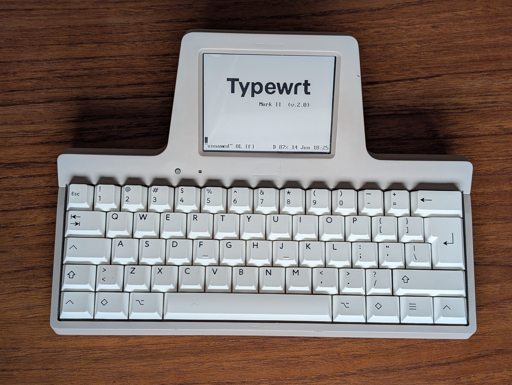
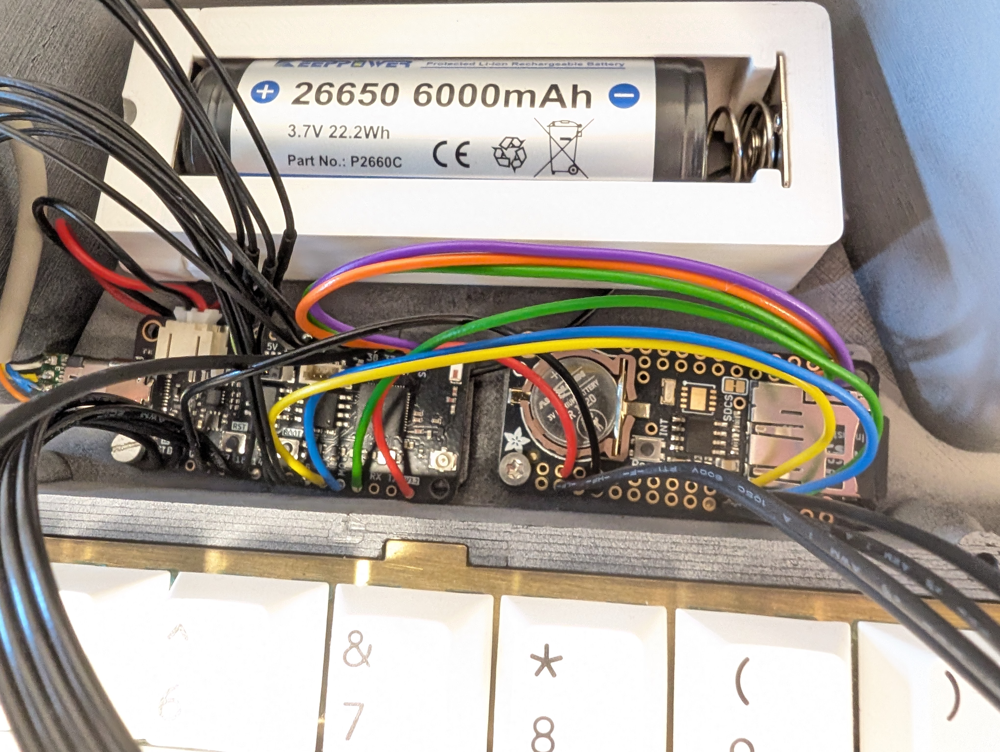
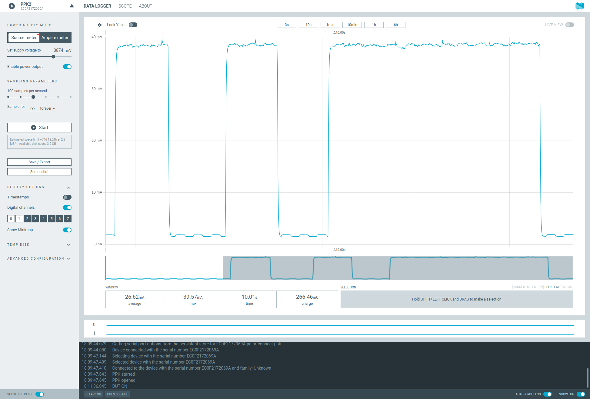

# Typewrt Mark II (ver 2.0)

Typewrt is a modern conception of a digital typewriter, designed as an
instrument for creating literary works without the need of further devices or
software. 
The idea revolves around a mechanical feeling, and it is designed with the
following key aspects:
1) Output: A reflective memory-in-pixel monochrome LCD from SHARP. This is a
4.4" display with a todays low resolution (320x240, QVGA). This resolution is 
enough to produce sharp glyphs using VGA font 8x16 bitmaps. It allows for 15
lines with 40 characters. The readability is exceptional both indoors and
outdoors. Because of the resolution and the ability to perform partial
refreshes, it updates very fast. 

2) Input: A mechanical keyboard with high quality switches and thick PBT
keycaps, arranged in a 60% layout. Mounted in a sturdy brass plate and a custom
made PCB. 
4) Power: Typewrt doesn't produce light. It doesn't stress the eyes. It doesn't
produce heat when you write on the lap. And it does not need a charger around.
The SHARP display is ultra low power. As it does the keyboard and the main
board. 
3) Process: The core of the device, and the main departure from a typewriter or 
a simple drafting device. Typewrt is an embedded vi text editor. It allows to
navigate through the document or documents very efficiently. Manipulate text
with any complexity, and recursively. Do search and replace, etc. You can even
autocomplete words, or perform fuzzy searches. It works natively with utf-8
encoding, and it can change the keyboard layout on the fly to english, spanish,
italian, french, german, norwegian, turkish and colemak.
5) Ergonomics: The design is meant to be robust and stable. The keyboard height
has been minimized. Cherry profile keycups are used, and the keyboard plane is
tilted by 6 degree.  The display distance and viewing angle is kept large
enough to allow long writing sessions. The display is 35 degree respect to the 
horizontal plane. The keyboard has been silenced as much as possible, so you
have a good peace of mind when typing in public places.  The tactility and
response of the keyboard is very conforting. 
6) Remote sync: The device has LE Bluetooth and allows to copy your files to
your phone consuming very little power, and without needing external networks.

The main difference of Typewrt mark II respect to the first iteration is the
hardware. Typewrt-I was built with a single-board-computer, running a ARM based 
linux from which you could run any program on the terminal. 
Typewrt-II doesn't have a computer. There is no terminal or specific drivers for
the keyboard or the display. Keyboard, display and text processor conform a
unique firmware embedded into a ESP32S3 microprocessor. 
Just one application (a modified vi editor with a simple file browser), running 
in a much more constrained environment. 8 MB of ram memory instead of 0.5 GB in
Typewrt-I. 1 MB firmware on flash memory instead of 0.5GB of linux distribution. 
And still, it performs faster, and consumes much less power. 
The interaction with Typewrt-2 is straight. There is no loggins or shells or
passwords. You press the power button and start writing instant on a blank 
document.

# How to:
Because the esp firmware is a submodule repository, clone this project as 
``` 
git clone --recurse-submodules https://github.com/vmodamio/typewrt_mark2.git 
```
The building process might be a long project. Please dont hesitate to ask if you
find difficulties and/or lack of documentation. 
For flashing the firmware, you need the Espressiff IDF installed in your computer.
You can follow [the instructions here for the v6.0](https://docs.espressif.com/projects/esp-idf/en/v6.0.1/esp32s3/get-started/index.html)
Once installed, from the /firmware/esp folder:
``` 
idf.py build
idf.py flash
```

# Firmware:
The text editor has been forked from the [fantastic nextVi](https://github.com/kyx0r/nextvi) 
text editor by Kyryl Melekhin. The editor, originally a terminal program, has been 
adapted to an embedded firmware using the Espressiff IDF, and it runs under FreeRTOS. 
Regarding functionality, the original right-to-left support, all the syntax highlight and 
filetype code, as well as all shell/terminal related code has been removed. 
The program has been adapted to a non-terminal environment, with a custom
keyboard and display interpretation. Additionally, all the functionality related to
files, paths or filesystem in general, has been derived to a more-dedicated filebrowser. 
The filebrowser is in fact the place where you land with the former quit command. 
A battery, memmory and date/time status has been added, as well as a BLE small protocol 
to transfer files.  And last, an special hard-wrap mechanism has been implemented.  


# Hardware:
The machine consists on a feather ESP32s3[d] (unexpected maker) and an Adafruit
adalogger RTC+SD card. The Sharp MIP 4.4" display, is mounted in a custom PCB
that has a 5V booster, and a 7555 timer for the vcom signal (both ultra low
power). The keyboard pcb consists barely on an octal latch SN74HC573A that
drives 8 inputs/outputs. In addition, a power button and a yellow led on the 
enclosure, and a usb-c connector on the back. For the connector, a tiny pcb was
made to pull down the CC1 and CC2 lines with 5.1k. It has also a small jumper to
remove the data lines, in case you dont want someone touching your firmware. 

# Power figures:
Typewrt main display, the SHARP MIP, consumes 50 uA when idle, and 600 uA when
refreshing. It is probably the lowest power display ever. This, considering
that, in many writing divices, the display is by far the most power hungry part.
The keyboard on Typewrt mark I was implemented on a low power STM32
microcontroller, working in interrupt mode and sleeping most of the time, and
sending via uart events. Typewrt mark II is just one microcontroller, doing
exactly the same task as for the keyboard, but for the whole firmware. 
The display vcom signal is hardware produced with the timer, so no task is
needed for the display when the system is idle.
Check the power consumption folder for real measurements.
Machine idle is around 1.4 mA, typing costs 38 mA, and deep sleep 340 uA.



# Vi at a glance:

Vi is one of the main text editors in unix/linux distributions. Its
functionality is divided into three different modes: insert, nomal and ex mode.
Once you are inside vi, you press "i" to enter insert mode, and you can start
typing in your document. Many people hate vi just because this initial
frustration, akwardness responses of the keyboard when you are not in Insert
mode. This is because vi is very powerful. It has many key bindings, and the
learning curve is somehow step. 

In insert mode, it behaves like the simplest text editor you could imagine. As
far as you dont escape, pressing the Esc key, you basically insert characters
in your text buffer. There are very few but useful key bindings in insert mode
however. Press Ctrl-W to delete your last word. Or Ctrl-N to autocomplete a
word you started typing.  To save your text (to write your buffer into a file),
you escape to enter normal mode, then you type ":" to enter ex mode, and "w
<filename>" to write.

Normal mode is where things get fun. In this mode you dont create text by
typing, but instead you type keybindings to manipulate the text you already
have, or navigate throw the buffer/buffers, copy or paste pieces of text into
the buffer, or different registers, search or replace, delete, and many other
things. This editor paradigm works very nice for coding, among other things,
were you would spend considerable part of your time rearranging pieces of text
or modifying functions or variables. For writing fiction I find it equally
useful.  The navigation, or movements, are the first step departing from your
standard, plain editor. The left, right, up and down cursor movements in vi are
arranged in the main keyboard row as h,j,k,l for left, down, up and right. 
That is the main reason you would't need arrow keys in a vi text editor. 
If you get used to this, you wont miss again the arrow keys.  You can move
forward or backwards by words, paragraphs, programmed marks, entire
documents/buffers.
You can concatenate actions with movements, like delete 5 words backwards, or
find character <character> 3 times, to say, or copy text til mark, or
paste register 1...  Pressing "." in normal mode executes the last instruction
again. For example "dB" to delete backwards  to the begining of a word
(including punctuation). Then pressing "." will continue to delete that way.

# Credits:
The text editor is based on the nextVI project (please refer to the firmware folder).
The VGA font is borrowed from the ZAP group, Australia (Copyright (C) 2004–26, John Zaitseff).
The font used for the splash screen is MomoTrustDisplay-Regular.ttf (Google fonts) 
designed by Type Associates, Copyright 2024 The MoMo Trust Display Project Authors. 

